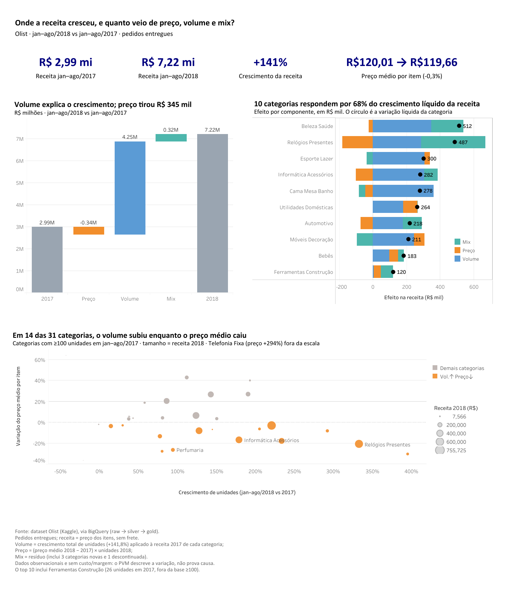

# 🛒 Olist Pricing Analytics — Análise PVM no BigQuery


Este projeto consiste em uma análise de **preço, volume e mix (PVM)** sobre dados reais do e-commerce brasileiro (Olist), partindo de CSVs brutos até dois dashboards analíticos: um no Looker Studio e outro no Tableau Public.

O foco do projeto é demonstrar modelagem em camadas no BigQuery, controle de qualidade de dados, reconciliação entre camadas e comunicação de insights de negócio com limitações explícitas.

**Pergunta de negócio:** onde a receita cresceu ou caiu por categoria, quanto dessa variação veio de preço, volume ou mix, e o que isso sugere para decisões de preço e portfólio?

---

## 📌 Visão Geral do Projeto

O pipeline foi estruturado em três camadas de dados, cada uma em um dataset do BigQuery:

| Camada | Descrição |
| --- | --- |
| **Raw** | Dados brutos exatamente como fornecidos (6 tabelas carregadas do [Kaggle - Brazilian E-Commerce by Olist](https://www.kaggle.com/datasets/olistbr/brazilian-ecommerce)) |
| **Silver** | `order_items_clean`: um registro por item de pedido entregue (110.197 linhas), com categoria tratada, estado do cliente e flag de frete maior que o preço |
| **Gold** | `metricas_categoria_mes_estado` (métricas por categoria × mês × estado) e `pvm_categoria` (decomposição PVM por categoria) |

Dos dashboards ao BigQuery, todos os números foram conferidos contra consultas diretas na camada Gold (veja [`docs/validacao_dashboard.md`](docs/validacao_dashboard.md)).

## 🏗️ Arquitetura do Pipeline

```
CSVs brutos (Kaggle)
   ↓
Carga manual no BigQuery  →  raw
   ↓
sql/03  →  silver.order_items_clean   (só pedidos entregues)
   ↓
sql/04  →  gold.metricas_categoria_mes_estado
   ↓
sql/05  →  gold.pvm_categoria
   ↓
Looker Studio  |  Tableau Public
```

## 📊 Dashboards

O PVM compara **jan–ago/2017 com jan–ago/2018**, usando apenas pedidos entregues e receita sem frete. O recorte evita a sazonalidade e a baixa cobertura do fim de 2016 e do fim de 2018.



**Principais análises abordadas:**

- Decomposição da variação de receita em preço, volume e mix (cascata)
- Top 10 categorias por contribuição ao crescimento líquido
- Relação entre variação de preço e crescimento de unidades por categoria
- Performance por categoria, mês e estado (Looker Studio)

🔗 **Looker Studio:** [dashboard interativo](https://datastudio.google.com/s/rlEa1RaA66M)

🔗 **Tableau Public:** [painel PVM](https://public.tableau.com/views/AnlisePVMOlist/Painel_PVM_Olist)

📄 **Preview em PDF:** [`docs/visuals/dashboard_visao_geral.pdf`](docs/visuals/dashboard_visao_geral.pdf)

> **Observação:**
> Para a análise completa, com insights, recomendações e limitações, consulte: [`docs/analise.md`](docs/analise.md)

## 🔎 Principais Resultados

| Métrica | Jan–ago/2017 | Jan–ago/2018 | Variação |
| --- | --- | --- | --- |
| Receita | R$ 2,99 mi | R$ 7,22 mi | +141,1% |
| Unidades | 24.943 | 60.324 | +141,8% |
| Preço médio por item | R$ 120,01 | R$ 119,66 | −0,3% |

| Componente | Efeito na receita |
| --- | --- |
| Preço | −R$ 345 mil |
| Volume | +R$ 4,25 mi |
| Mix | +R$ 324 mil |

- **O preço médio estável esconde uma queda de preço.** Na mesma cesta de produtos, o preço caiu cerca de 4,6%. A mudança de composição entre categorias compensou a queda no preço médio total.
- **A queda de preço é concentrada.** Relógios Presentes, Informática Acessórios e Automotivo somam −R$ 358 mil de efeito preço.
- **O crescimento é concentrado.** 10 categorias respondem por 68% do crescimento líquido da receita.
- **Beleza Saúde é a maior fonte de crescimento sem sacrificar preço:** +R$ 512 mil com preço praticamente estável.

> Os dados são observacionais e não incluem custo nem margem. O PVM descreve a variação, mas não prova causa.

## 📈 Principais KPIs

- Receita (soma do preço dos itens, sem frete)
- Unidades vendidas e pedidos distintos
- Preço médio por item → *(receita ÷ unidades)*
- Ticket médio → *(receita ÷ pedidos)*
- Efeito preço → *(preço médio 2018 − preço médio 2017) × unidades 2018*
- Efeito volume → *crescimento total de unidades × receita 2017 da categoria*
- Efeito mix → *variação de receita − efeito preço − efeito volume*
- Índice de preço de mesma cesta (categorias contínuas)

## 🛠️ Tecnologias Utilizadas

- **Google Cloud Platform** (BigQuery, modo Sandbox)
- **SQL** (BigQuery Standard SQL)
- **Looker Studio**
- **Tableau Public**
- **Git & GitHub**
- **Modelagem em camadas** (raw → silver → gold)

## 📁 Estrutura do repositório

```
.
├── datasets/
│   └── README_DATASETS.md          # descrição dos dados (CSVs brutos não versionados)
├── sql/
│   ├── 01_exploracao_raw.sql       # contagens, período e status dos pedidos
│   ├── 02_auditoria_raw.sql        # checagens de qualidade
│   ├── 03_tabela_silver.sql        # silver.order_items_clean
│   ├── 04_tabela_gold.sql          # gold.metricas_categoria_mes_estado + reconciliação
│   ├── 05_pvm_categoria.sql        # gold.pvm_categoria + reconciliação + exports
│   └── 06_validacao_insights.sql   # consultas que reproduzem os números da análise
├── docs/
│   ├── analise.md                  # insights, recomendações e limitações
│   ├── raw_load_notes.md           # carga da camada raw
│   ├── data_quality_rules.md       # regras de qualidade e tratamentos
│   ├── data_dictionary.md          # métricas, colunas e linhagem
│   ├── validacao_dashboard.md      # dashboard x BigQuery
│   ├── csv/                        # resultados agregados do PVM
│   ├── prints/                     # prints dos dashboards e da validação
│   └── visuals/                    # painel Tableau (PNG) e visão geral (PDF)
├── links.md
├── .gitignore
├── LICENSE
└── README.md
```

## ⚙️ Reprodutibilidade

Os arquivos brutos não estão no repositório (licença do dataset e tamanho). Para reproduzir:

1. Baixe os CSVs no [Kaggle](https://www.kaggle.com/datasets/olistbr/brazilian-ecommerce).
2. Crie um projeto no GCP e os datasets `raw`, `silver` e `gold` no BigQuery (região US).
3. Carregue os CSVs em `raw` conforme [`docs/raw_load_notes.md`](docs/raw_load_notes.md).
4. Substitua o ID do projeto (`analise-olist-pricing`) nas consultas pelo seu.
5. Execute os arquivos de `sql/` em ordem, de `01` a `06`.

As tabelas resultantes do PVM também estão em [`docs/csv/`](docs/csv/), para consulta sem executar o pipeline.

## ⚠️ Limitações

- Dados observacionais, sem custo ou margem.
- Período de expansão do marketplace: o crescimento reflete a plataforma, não o mercado.
- O efeito preço inclui troca de produtos dentro da categoria.
- O efeito volume é uniforme por construção; quem diferencia categorias é preço e mix.
- O PVM foi feito por categoria, e não por estado (a camada Gold já tem o estado).

Lista completa em [`docs/analise.md`](docs/analise.md).

## 🎯 Objetivo Profissional do Projeto

Este projeto tem como objetivo demonstrar habilidades em:

- SQL analítico e modelagem em camadas no BigQuery
- Auditoria e controle de qualidade de dados
- Reconciliação entre camadas e validação de dashboards
- Análise de preço, volume e mix
- Visualização em Looker Studio e Tableau
- Comunicação de insights de negócio

## 👤 Autor

Desenvolvido por **Ramon Lodi de Sousa** 🚀
[GitHub](https://github.com/ramonlodi) · [LinkedIn](https://linkedin.com/in/ramonlodi)

## 📄 Licença

Código distribuído sob a licença MIT. Veja o arquivo [LICENSE](LICENSE) para mais detalhes.
Os dados de origem pertencem à Olist e seguem a licença [CC BY-NC-SA 4.0](https://creativecommons.org/licenses/by-nc-sa/4.0/).